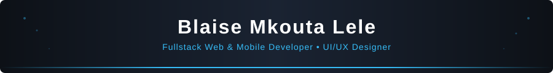

<!-- Banner (fichier local dans le repo - 100% fiable) -->

  

<!-- Typing SVG (hosted on vercel, plus fiable) -->

  

  J'accompagne startups et entreprises dans la conception de produits numériques performants, maintenables et orientés business.
   
  📍 Douala, Cameroun

---

## ✨ Qui suis-je ?

- 👨‍💻 Développeur Fullstack (Web & Mobile)  
- 🎨 UI/UX Designer passionné par la création d'interfaces intuitives et modernes  
- 🚀 Intéressé par les produits SaaS, l'automatisation et les architectures scalables  
- 🧠 Axé qualité : clean code, bonnes pratiques, tests, performance  
- 🌍 Vision orientée impact local & solutions adaptées au contexte africain  

---

## 🚀 Ce que je peux faire pour vous

- Concevoir des applications web modernes (Angular, React, Next.js)  
- Développer des backends robustes et scalables (NestJS, Node.js, Express.js)  
- Créer des applications mobiles cross-platform (React Native)  
- Designer des interfaces intuitives et modernes (UI/UX, Tailwind)  
- Mettre en place des bases de données fiables (MySQL, PostgreSQL)  
- Conteneuriser et industrialiser les projets (Docker)  
- Mettre en place CI/CD, bonnes pratiques Git et organisation projet  

---

## 🛠️ Tech Stack

### Frontend

### Mobile

### Backend

### Database & Tools

---

## 💎 Projets

- 🔹 **Ekose-RX – Plateforme de téléconsultation médicale**  
  Plateforme sécurisée pour consultations médicales en ligne  
  *Frontend : React Native*  
  *Backend : Express.js, Prisma*  
  🔒 Gestion sécurisée des utilisateurs, paiement et stockage cloud  

---

## 💼 Expérience

- **2025 - présent : Développeur Fullstack – Sekure Technologie**  

---

## 📊 Stats GitHub

  
  

  

---

## 🤝 Contact & Réseaux

  
  

---

💡 *Vision : construire des solutions numériques utiles, adaptées au terrain, et pensées pour évoluer.*
